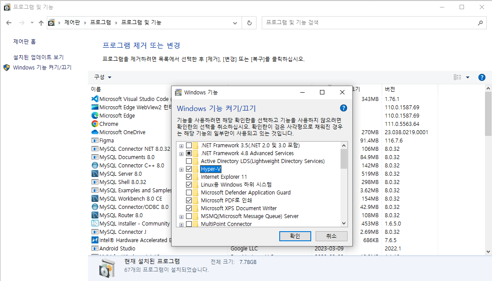

# 1. Docker 설치

## 1. WSL2 Windows 버젼 맞춰 사용 등록

가상 환경

[Windows 10 에서 WSL2 설치 및 Ubuntu 사용하기.](https://it-svr.com/windows-10-wsl2-activate/)

wsl2 커널 다운 오류 → Hyper-V 가상 환경 체크해주기



만약 이미 Ubuntu terminal environment platform 배포판이 설치되어 있다면

wsl1 → wsl2 upgrade & update (해당 Ubuntu 버젼으로 맞춰서 2로 업데이트)를 해야 한다.


ubuntu 배포판 설치


⇒ windows 에서 ubuntu를 쓸 수 있는 가상 환경 설정

powershell 에서 wsl2 설정 되어 있는지 확인

```
wsl2 -l -v
```


\*\*windows는 Power Shell 에서 동작

version 확인

```
Power Shell
docker --version
```


## Test Folder 생성

C:\Users\SSAFY

등 C드라이브 → 사용자(Users) → 사용자명(SSAFY) 안에서 폴더를 생성한다.

## hub.docker.com

도커의 Image 파일을 찾을 수 있다.

## Docker 명령어

```
// run : docker Image 파일을 local PC에서 실행 하되 없으면 다운 받는다
// -it : run 명령어의 옵션으로, 이 컨테이너를 연 다음에 그 환경안에서 CLI를 사용
docker run -it node
```
